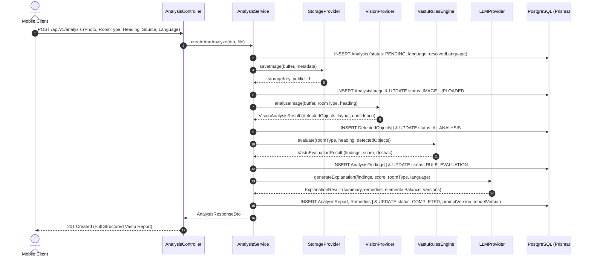
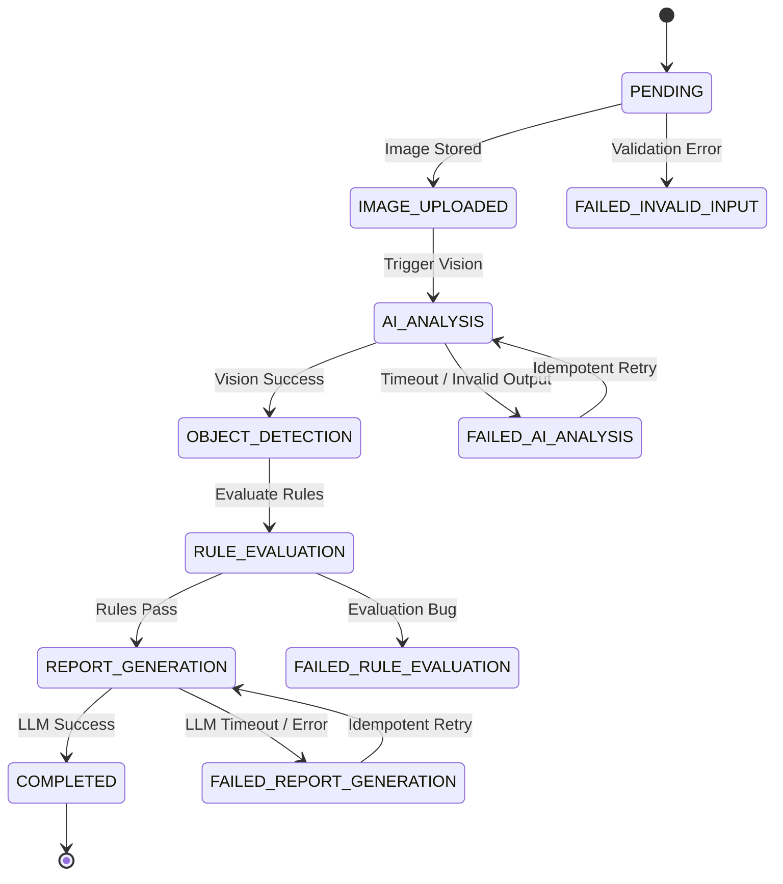

# System Architecture Specification

## 1. High-Level Architecture Overview

The Vastu AI backend is architected as a **Modular Clean Monolith** using **NestJS** and **TypeScript**. It enforces strict separation of concerns, domain-driven boundaries, and dependency inversion to guarantee that business logic—specifically the authoritative Vastu Rules Engine—remains isolated from external AI models, cloud storage vendors, and web transport layers.

```
                          ┌───────────────────────────┐
                          │    Mobile Client (App)    │
                          └─────────────┬─────────────┘
                                        │ HTTPS / REST (v1)
                                        ▼
┌─────────────────────────────────────────────────────────────────────────────────┐
│                             PRESENTATION LAYER (API)                            │
│  - AnalysisController     - AuthController        - UsersController             │
│  - Global ValidationPipe  - JwtAuthGuard          - HttpExceptionFilter         │
│  - LoggingInterceptor     - TransformInterceptor  - RateLimiter (Throttler)     │
└───────────────────────────────────────┬─────────────────────────────────────────┘
                                        │
                                        ▼
┌─────────────────────────────────────────────────────────────────────────────────┐
│                            APPLICATION LAYER (USE CASES)                        │
│  - CreateAnalysisUseCase  - ProcessAnalysisPipelineJob                          │
│  - GetAnalysisDetails     - RetryFailedAnalysisJob                              │
│  - DTO Mappers            - State Machine Coordinator                           │
└───────────────────┬───────────────────────────────────────────┬─────────────────┘
                    │                                           │
                    ▼                                           ▼
┌───────────────────────────────────────┐   ┌─────────────────────────────────────┐
│             DOMAIN LAYER              │   │        INFRASTRUCTURE LAYER         │
│  - Vastu Rules Engine (Deterministic) │   │  - Storage Adapters (Local / S3)    │
│  - Vastu Rule Entity & Registry       │   │  - Vision Adapters (OpenAI / Mock)  │
│  - Room & Direction Value Objects     │   │  - LLM Adapters (Claude/OpenAI/Mock)│
│  - Analysis Aggregate Root            │   │  - Prisma ORM / PostgreSQL Client   │
│  - Domain Exception Hierarchy         │   │  - Winston / Pino Structured Logger │
└───────────────────────────────────────┘   └─────────────────────────────────────┘
```

---

## 2. Architectural Layers & Boundaries

### 2.1. Presentation Layer (API Transport)
- **Role**: Handles HTTP requests, parses multipart/form-data image payloads, validates input DTOs, validates compass headings, authenticates caller identity via JWT, and transforms outputs into standard JSON envelopes.
- **Rules**: Zero business logic. No database transactions. No direct calls to AI SDKs.

### 2.2. Application Layer (Orchestration & Workflow)
- **Role**: Coordinates the multi-step spatial analysis pipeline:
  1. Persists analysis intent in `PENDING` state.
  2. Delegates raw image upload to the `StorageProvider`.
  3. Updates state to `IMAGE_UPLOADED`.
  4. Triggers `VisionProvider` to detect spatial objects, boundaries, and confidence levels.
  5. Updates state to `AI_ANALYSIS` and persists `DetectedObject` entities.
  6. Passes normalized objects and compass direction to the domain `VastuRulesEngine`.
  7. Updates state to `RULE_EVALUATION` and persists `AnalysisFinding` entities.
  8. Passes findings to `LLMProvider` to generate empathetic summaries and tailored remedies.
  9. Updates state to `REPORT_GENERATION` and persists `AnalysisReport`.
  10. Transitions analysis state to `COMPLETED`.
- **Fault Tolerance**: Contains retry strategies with exponential backoff for transient AI failures and state rollbacks.

### 2.3. Domain Layer (Core Business Rules)
- **Role**: Encapsulates Vastu Shastra principles, spatial coordinate mathematics, and scoring algorithms.
- **Rule Independence**: Completely pure TypeScript. **Has zero dependencies on NestJS decorators, Prisma, or third-party AI libraries.** Can be executed in a browser, CLI, or microservice without any changes.
- **Deterministic Evaluation**: Given the exact same set of detected objects and room orientation, the rules engine produces the exact same score and findings 100% of the time.

### 2.4. Infrastructure Layer (Ports & Adapters)
- **Role**: Implements domain and application interfaces to interact with external I/O:
  - `PrismaService` for PostgreSQL.
  - `S3StorageAdapter` / `LocalStorageAdapter` for image storage.
  - `OpenAiVisionAdapter` / `GeminiVisionAdapter` / `MockVisionAdapter` for image comprehension.
  - `ClaudeLlmAdapter` / `OpenAiLlmAdapter` / `MockLlmAdapter` for explanation synthesis.
  - `PinoLoggerService` for structured JSON log streaming.

---

## 3. Modular Monolith Architecture

The backend is organized into bounded modules under `backend/src/modules/`:

| Module | Responsibility | Key Exports |
| :--- | :--- | :--- |
| `auth` | User signup, login, JWT token issuance, refresh tokens, password hashing | `AuthService`, `JwtAuthGuard` |
| `users` | User profile management, role resolution, preferences | `UsersService` |
| `storage` | Abstract file storage, MIME type validation, pre-signed URL generation | `StorageProvider` (Port) |
| `ai` | Abstract AI adapters for Vision and LLM synthesis, schema validators | `VisionProvider`, `LLMProvider` (Ports) |
| `vastu` | Pure deterministic Vastu Rules Engine, rule registries, scoring algorithms | `VastuRulesEngine`, `RuleRegistry` |
| `analysis` | Analysis aggregate root, pipeline orchestration, state machine, history APIs | `AnalysisService`, `AnalysisController` |
| `reports` | Report aggregation, summary formatting, export utilities | `ReportsService` |

### Dependency Graph Between Modules

```
                    ┌───────────────┐
                    │  app.module   │
                    └───┬───┬───┬───┘
         ┌──────────────┘   │   └──────────────┐
         ▼                  ▼                  ▼
   ┌───────────┐      ┌───────────┐      ┌───────────┐
   │auth.module│◄────►│users.module      │storage.mod│
   └─────┬─────┘      └─────┬─────┘      └─────┬─────┘
         │                  │                  │
         └──────────┐       │       ┌──────────┘
                    ▼       ▼       ▼
                ┌───────────────────────┐
                │    analysis.module    │
                └───┬───────────────┬───┘
                    │               │
         ┌──────────┘               └──────────┐
         ▼                                     ▼
   ┌───────────┐                         ┌───────────┐
   │ ai.module │                         │vastu.mod  │ (Pure Domain)
   └───────────┘                         └───────────┘
         │                                     ▲
         └─────────────────────────────────────┘
          (ai does NOT depend on vastu rules!)
```

---

## 4. End-to-End Analysis Data Flow



---

## 5. Analysis State Machine & Resilience

To prevent zombie analyses and provide idempotent retries, the analysis lifecycle is strictly state-machine driven:



### Idempotency & Failure Recovery
1. **Deduplication**: When an analysis upload is initiated, an SHA-256 image content hash combined with `(userId, roomType, compassHeading)` is checked. If an identical active analysis was created within the last 5 minutes, the existing resource is returned.
2. **Safe Retries**: If the pipeline fails at `FAILED_AI_ANALYSIS` or `FAILED_REPORT_GENERATION`, the client can invoke `POST /api/v1/analysis/:id/retry`. The system reuses the already persisted image and avoids re-uploading.

---

## 6. Observability & Telemetry

- **Correlation IDs**: Each incoming HTTP request receives or inherits an `x-request-id` header (UUIDv4), attached to all log statements, database queries, and downstream AI calls.
- **AI Latency & Token Tracking**: All external calls to Vision and LLM APIs record:
  - Latency in milliseconds.
  - Prompt tokens, completion tokens, and total tokens.
  - Model name and version used.
  - Confidence distribution of detected objects.
- **Sensitive Data Masking**: Log interceptors redact authentication tokens, passwords, binary image buffers, and PII.

---

## 7. Future Scalability & Microservices Extraction

While V1 is built as a clean modular monolith:
1. The **Vastu Rules Engine** is isolated in `modules/vastu` with no external dependencies and can be published as an independent NPM package or standalone WASM/microservice.
2. The **AI Pipeline** can be moved from synchronous HTTP processing to a background worker queue (e.g., BullMQ + Redis) in V2 without modifying the domain or controller layers.

---

## 8. Multilingual Architecture & Localization Strategy

### 8.1. Separation of Static UI vs Dynamic AI Content
- **Static UI Localization**: Managed natively within the React Native client (`app/src/i18n/locales/*.json`). Zero AI calls are made for buttons, titles, errors, or forms, ensuring instant rendering, offline resilience, and zero API token overhead.
- **Dynamic AI Content**: The LLM synthesizes natural-language explanations, elemental summaries, and remedy guidance directly in the requested language (`en`, `hi`, `ta`, `te`, `kn`, `ml`, `bn`, `gu`, `mr`, `pa`).

### 8.2. Deterministic Rule Independence
- The core **Vastu Rules Engine** remains 100% language-agnostic and mathematical.
- All evaluation findings output immutable ASCII constants (`ruleCode`, `severity`, `verdict`, `remedyType`).
- Business logic never branches on language code.

### 8.3. Auditability & Historical Immutability
- Analyses record `languageCode`, `promptVersion`, and `modelVersion`.
- A change in user preference affects future analyses only; historical reports permanently retain their generation language.

