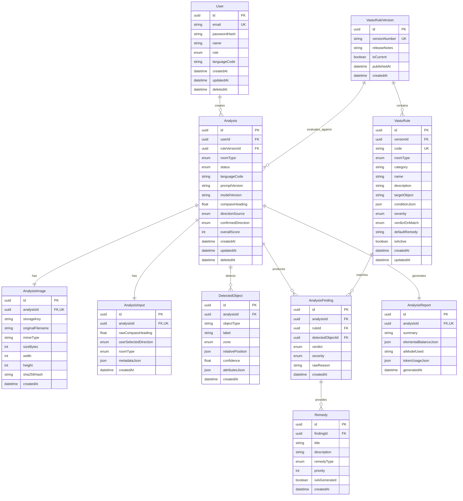

# Database Architecture & Schema Design

- **RDBMS**: PostgreSQL 16+
- **ORM / Migrations**: Prisma ORM
- **Naming Conventions**: `camelCase` for fields, `PascalCase` for models, `snake_case` for database table and column mappings.

---

## 1. Entity Relationship Diagram (ERD)



---

## 2. Table Specifications & Indexes

### 2.1. `User`
Stores authenticated users.
- `id`: UUIDv4 Primary Key.
- `email`: VARCHAR(255), Unique, Indexed.
- `passwordHash`: VARCHAR(255).
- `name`: VARCHAR(100), Optional display name.
- `role`: Enum (`USER`, `ADMIN`).
- `languageCode`: VARCHAR(10), Default: `'en'`. Stores the user's persisted language preference.
- `deletedAt`: Soft-delete timestamp.
- **Indexes**: `CREATE UNIQUE INDEX idx_user_email ON "users"(email) WHERE "deletedAt" IS NULL;`

### 2.2. `Analysis`
Aggregate root for an analysis execution.
- `id`: UUIDv4 Primary Key.
- `userId`: FK referencing `User(id)` with `ON DELETE CASCADE`.
- `ruleVersionId`: FK referencing `VastuRuleVersion(id)`.
- `status`: Enum (`PENDING`, `IMAGE_UPLOADED`, `AI_ANALYSIS`, `OBJECT_DETECTION`, `RULE_EVALUATION`, `REPORT_GENERATION`, `COMPLETED`, `FAILED_AI_ANALYSIS`, `FAILED_RULE_EVALUATION`, `FAILED_REPORT_GENERATION`).
- `roomType`: Enum (`BEDROOM`, `LIVING_ROOM`, `KITCHEN`, `MAIN_ENTRANCE`, `OFFICE`).
- `languageCode`: VARCHAR(10), Default: `'en'`. Language used for this specific analysis report.
- `promptVersion`: VARCHAR(50), Nullable. Prompt template version identifier (e.g., `explanation-v1.2.0`).
- `modelVersion`: VARCHAR(50), Nullable. AI provider model version identifier (e.g., `gpt-4o-mini`).
- `overallScore`: Integer (0 to 100), nullable until evaluated.
- **Indexes**:
  - `CREATE INDEX idx_analysis_user_created ON "analyses"(user_id, created_at DESC) WHERE "deletedAt" IS NULL;`
  - `CREATE INDEX idx_analysis_status ON "analyses"(status);`

### 2.3. `AnalysisImage`
Stores immutable image metadata and storage references.
- `sha256Hash`: Hex-encoded SHA-256 hash of image bytes. Used for deduplication.
- **Indexes**:
  - `CREATE INDEX idx_analysis_image_hash ON "analysis_images"(sha256_hash);`

### 2.4. `DetectedObject`
Stores factual objects detected by the Vision AI.
- `zone`: Enum (`NORTH`, `NORTH_EAST`, `EAST`, `SOUTH_EAST`, `SOUTH`, `SOUTH_WEST`, `WEST`, `NORTH_WEST`, `CENTER`).
- `relativePosition`: JSONB storing `{ "x": 0.5, "y": 0.5, "w": 0.2, "h": 0.3 }`.
- `attributesJson`: JSONB storing object attributes (e.g. `{ "headboard": "SOUTH", "material": "wood" }`).
- **Indexes**: `CREATE INDEX idx_detected_object_analysis ON "detected_objects"(analysis_id);`

### 2.5. `VastuRule` & `VastuRuleVersion`
Implements immutable rule versioning.
- Every set of Vastu rules belongs to a published `VastuRuleVersion` (e.g. `v1.0.0`).
- When a user requests an analysis, the active version is bound to `Analysis.ruleVersionId`.
- If rules are updated, a new version is created. Old analyses continue to reference their original version, ensuring historical evaluations remain 100% reproducible.
- **Indexes**:
  - `CREATE UNIQUE INDEX idx_rule_code_version ON "vastu_rules"(code, version_id);`
  - `CREATE INDEX idx_rule_room_type ON "vastu_rules"(room_type, is_active);`

### 2.6. `AnalysisFinding` & `Remedy`
Stores deterministic rule evaluation findings and concrete remedies.
- `verdict`: Enum (`COMPLIANT`, `DEFECT`, `NEUTRAL`).
- `severity`: Enum (`LOW`, `MEDIUM`, `HIGH`, `CRITICAL`).
- `remedyType`: Enum (`STRUCTURAL`, `ELEMENTAL`, `DECORATIVE`, `COLOR`).

---

## 3. Complete Prisma Schema Blueprint

```prisma
datasource db {
  provider = "postgresql"
  url      = env("DATABASE_URL")
}

generator client {
  provider = "prisma-client-js"
}

enum Role {
  USER
  ADMIN
}

enum RoomType {
  BEDROOM
  LIVING_ROOM
  KITCHEN
  MAIN_ENTRANCE
  OFFICE
}

enum Direction {
  NORTH
  NORTH_EAST
  EAST
  SOUTH_EAST
  SOUTH
  SOUTH_WEST
  WEST
  NORTH_WEST
  CENTER
}

enum DirectionSource {
  DEVICE_COMPASS
  USER_SELECTED
  UNKNOWN
}

enum AnalysisStatus {
  PENDING
  IMAGE_UPLOADED
  AI_ANALYSIS
  OBJECT_DETECTION
  RULE_EVALUATION
  REPORT_GENERATION
  COMPLETED
  FAILED_AI_ANALYSIS
  FAILED_RULE_EVALUATION
  FAILED_REPORT_GENERATION
  FAILED_INVALID_INPUT
}

enum Verdict {
  COMPLIANT
  DEFECT
  NEUTRAL
}

enum Severity {
  LOW
  MEDIUM
  HIGH
  CRITICAL
}

enum RemedyType {
  STRUCTURAL
  ELEMENTAL
  DECORATIVE
  COLOR
}

model User {
  id           String     @id @default(uuid()) @db.Uuid
  email        String     @unique @db.VarChar(255)
  passwordHash String     @map("password_hash") @db.VarChar(255)
  name         String?    @db.VarChar(100)
  role         Role       @default(USER)
  languageCode String     @default("en") @map("language_code") @db.VarChar(10)
  createdAt    DateTime   @default(now()) @map("created_at")
  updatedAt    DateTime   @updatedAt @map("updated_at")
  deletedAt    DateTime?  @map("deleted_at")

  analyses     Analysis[]

  @@map("users")
}

model VastuRuleVersion {
  id            String      @id @default(uuid()) @db.Uuid
  versionNumber String      @unique @map("version_number") @db.VarChar(20)
  releaseNotes  String?     @map("release_notes") @db.Text
  isCurrent     Boolean     @default(false) @map("is_current")
  publishedAt   DateTime    @default(now()) @map("published_at")
  createdAt     DateTime    @default(now()) @map("created_at")

  rules         VastuRule[]
  analyses      Analysis[]

  @@map("vastu_rule_versions")
}

model VastuRule {
  id              String            @id @default(uuid()) @db.Uuid
  versionId       String            @map("version_id") @db.Uuid
  code            String            @db.VarChar(50)
  roomType        RoomType          @map("room_type")
  category        String            @db.VarChar(50)
  name            String            @db.VarChar(150)
  description     String            @db.Text
  targetObject    String            @map("target_object") @db.VarChar(50)
  conditionJson   Json              @map("condition_json")
  severity        Severity          @default(MEDIUM)
  verdictOnMatch  Verdict           @default(DEFECT) @map("verdict_on_match")
  defaultRemedy   String            @map("default_remedy") @db.Text
  isActive        Boolean           @default(true) @map("is_active")
  createdAt       DateTime          @default(now()) @map("created_at")
  updatedAt       DateTime          @updatedAt @map("updated_at")

  version         VastuRuleVersion  @relation(fields: [versionId], references: [id], onDelete: Cascade)
  findings        AnalysisFinding[]

  @@unique([code, versionId])
  @@index([roomType, isActive])
  @@map("vastu_rules")
}

model Analysis {
  id                 String            @id @default(uuid()) @db.Uuid
  userId             String            @map("user_id") @db.Uuid
  ruleVersionId      String            @map("rule_version_id") @db.Uuid
  roomType           RoomType          @map("room_type")
  status             AnalysisStatus    @default(PENDING)
  languageCode       String            @default("en") @map("language_code") @db.VarChar(10)
  promptVersion      String?           @map("prompt_version") @db.VarChar(50)
  modelVersion       String?           @map("model_version") @db.VarChar(50)
  compassHeading     Float?            @map("compass_heading")
  directionSource    DirectionSource   @default(UNKNOWN) @map("direction_source")
  confirmedDirection Direction?        @map("confirmed_direction")
  overallScore       Int?              @map("overall_score")
  createdAt          DateTime          @default(now()) @map("created_at")
  updatedAt          DateTime          @updatedAt @map("updated_at")
  deletedAt          DateTime?         @map("deleted_at")

  user               User              @relation(fields: [userId], references: [id], onDelete: Cascade)
  ruleVersion        VastuRuleVersion  @relation(fields: [ruleVersionId], references: [id])
  image              AnalysisImage?
  input              AnalysisInput?
  detectedObjects    DetectedObject[]
  findings           AnalysisFinding[]
  report             AnalysisReport?

  @@index([userId, createdAt(sort: Desc)])
  @@index([status])
  @@map("analyses")
}

model AnalysisImage {
  id               String    @id @default(uuid()) @db.Uuid
  analysisId       String    @unique @map("analysis_id") @db.Uuid
  storageKey       String    @map("storage_key") @db.VarChar(255)
  originalFilename String    @map("original_filename") @db.VarChar(255)
  mimeType         String    @map("mime_type") @db.VarChar(50)
  sizeBytes        Int       @map("size_bytes")
  width            Int?
  height           Int?
  sha256Hash       String    @map("sha256_hash") @db.VarChar(64)
  createdAt        DateTime  @default(now()) @map("created_at")

  analysis         Analysis  @relation(fields: [analysisId], references: [id], onDelete: Cascade)

  @@index([sha256Hash])
  @@map("analysis_images")
}

model AnalysisInput {
  id                    String            @id @default(uuid()) @db.Uuid
  analysisId            String            @unique @map("analysis_id") @db.Uuid
  rawCompassHeading     Float?            @map("raw_compass_heading")
  userSelectedDirection Direction?        @map("user_selected_direction")
  roomType              RoomType          @map("room_type")
  metadataJson          Json?             @map("metadata_json")
  createdAt             DateTime          @default(now()) @map("created_at")

  analysis              Analysis          @relation(fields: [analysisId], references: [id], onDelete: Cascade)

  @@map("analysis_inputs")
}

model DetectedObject {
  id               String            @id @default(uuid()) @db.Uuid
  analysisId       String            @map("analysis_id") @db.Uuid
  objectType       String            @map("object_type") @db.VarChar(50)
  label            String            @db.VarChar(100)
  zone             Direction
  relativePosition Json              @map("relative_position")
  confidence       Float
  attributesJson   Json?             @map("attributes_json")
  createdAt        DateTime          @default(now()) @map("created_at")

  analysis         Analysis          @relation(fields: [analysisId], references: [id], onDelete: Cascade)
  findings         AnalysisFinding[]

  @@index([analysisId])
  @@map("detected_objects")
}

model AnalysisFinding {
  id               String          @id @default(uuid()) @db.Uuid
  analysisId       String          @map("analysis_id") @db.Uuid
  ruleId           String          @map("rule_id") @db.Uuid
  detectedObjectId String?         @map("detected_object_id") @db.Uuid
  verdict          Verdict
  severity         Severity
  rawReason        String          @map("raw_reason") @db.Text
  createdAt        DateTime        @default(now()) @map("created_at")

  analysis         Analysis        @relation(fields: [analysisId], references: [id], onDelete: Cascade)
  rule             VastuRule       @relation(fields: [ruleId], references: [id])
  detectedObject   DetectedObject? @relation(fields: [detectedObjectId], references: [id])
  remedies         Remedy[]

  @@index([analysisId])
  @@map("analysis_findings")
}

model Remedy {
  id            String          @id @default(uuid()) @db.Uuid
  findingId     String          @map("finding_id") @db.Uuid
  title         String          @db.VarChar(150)
  description   String          @db.Text
  remedyType    RemedyType      @map("remedy_type")
  priority      Int             @default(1)
  isAiGenerated Boolean         @default(false) @map("is_ai_generated")
  createdAt     DateTime        @default(now()) @map("created_at")

  finding       AnalysisFinding @relation(fields: [findingId], references: [id], onDelete: Cascade)

  @@index([findingId])
  @@map("remedies")
}

model AnalysisReport {
  id                   String    @id @default(uuid()) @db.Uuid
  analysisId           String    @unique @map("analysis_id") @db.Uuid
  summary              String    @db.Text
  elementalBalanceJson Json      @map("elemental_balance_json")
  aiModelUsed          String?   @map("ai_model_used") @db.VarChar(50)
  tokenUsageJson       Json?     @map("token_usage_json")
  generatedAt          DateTime  @default(now()) @map("generated_at")

  analysis             Analysis  @relation(fields: [analysisId], references: [id], onDelete: Cascade)

  @@map("analysis_reports")
}
```
