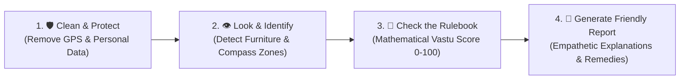

# Vastu AI — Comprehensive System Overview (Non-Technical & Technical)

> **Document Purpose**: This document serves as the complete guide for anyone wanting to understand **what** the Vastu AI backend does, **what it needs from users**, **what internal assets/engines it contains**, and **how it processes data from photo upload to final report**.
>
> - **Part 1** is written in **plain, non-technical language** for clients, business stakeholders, investors, and end-users.
> - **Part 2** is written for **software engineers, architects, and technical leads** detailing algorithms, data flow, security, and architectural contracts.

---

# Part 1: The Non-Technical Guide
### *For Business Leaders, Stakeholders, Clients & Product Teams*

---

## 1.1. What Are We Doing? (The Vision)

We have built an **automated, instant digital Vastu consultant**.

**Vastu Shastra** is the ancient Indian science of architecture and spatial harmony. For thousands of years, homes and workplaces in India and across the world have been planned around its principles—aligning rooms, furniture, fire, and water elements with the cardinal directions (North, South, East, West) to promote health, prosperity, and mental clarity.

Traditionally, getting a reliable Vastu consultation requires:
- Scheduling expensive in-person visits with consultants ($200 – $1,000+).
- Reading complex architectural floor plans.
- Often receiving alarming or fatalistic advice that demands breaking down walls or costly renovations.

**Our product solves this completely**:
A user captures a photo of any room using their smartphone, confirms the direction with the built-in compass, and receives an **instant, trustworthy, empathetic Vastu assessment** within 2 seconds—complete with a 0–100 score, clear explanations, and non-destructive remedies (like moving a bed, adding a lamp, or adjusting a mirror).

---

## 1.2. The Core Problem We Solved: "No AI Guessing"

When most people think of AI today, they think of ChatGPT or generative bots. But **standard AI has a major flaw: it hallucinates**. If you ask a generic AI bot for Vastu advice, it will invent rules on the spot, give contradictory answers, or blend folklore with authentic ancient texts.

Our breakthrough is **Strict Separation of Responsibilities**:
1. **The AI does NOT decide the Vastu rules.** 
2. The ancient rules are coded into our system like a **calculator**—precise, mathematically calculated, and grounded in canonical Vastu texts (*Mayamatam*, *Manasara*, *Samarangana Sutradhara*).
3. The AI is only used for what it is best at: **acting as the eyes** (to identify what furniture is in the room) and **acting as a friendly advisor** (to explain the results kindly and clearly).

---

## 1.3. What We Need from the User (The 3 Inputs)

To run an analysis, the user only needs to provide **3 simple inputs**:

| # | User Input | How It Is Provided | Why It Is Needed |
|:---|:---|:---|:---|
| **1** | **Room Type** | Selected from a clean menu: *Bedroom*, *Kitchen*, *Living Room*, *Main Entrance*, or *Office*. | Vastu rules depend completely on the room's function. A gas stove in the South-East is auspicious for a Kitchen, but dangerous in a Bedroom. |
| **2** | **One Photo** | Taken with the mobile camera or selected from the gallery. | Our visual engine needs to observe key objects (e.g. bed, stove, sink, mirror, desk, door) and their relative positions. |
| **3** | **Direction / Heading** | **Option A**: Automatic via the smartphone's built-in digital compass.<br>**Option B**: Manually chosen from an 8-point direction dial (North, North-East, East, etc.). | Vastu is fundamentally about directional energy. Knowing which way the camera or wall is facing anchors all calculations. |

*Optional: The user may add short notes, e.g., "Master bedroom on second floor."*

---

## 1.4. What We Have Built (The Internal Engine)

Inside our backend, four specialized components work together like a synchronized expert team:

```
┌─────────────────────────────────────────────────────────────────────────────┐
│                             OUR 4 CORE ENGINES                              │
├─────────────────┬──────────────────┬──────────────────┬─────────────────────┤
│ 🛡️ THE SHIELD   │  👁️ THE EYES     │  📐 THE SCHOLAR  │  🗣️ THE ADVISOR     │
│ (Privacy Guard) │ (Vision AI)      │ (Rules Engine)   │ (Language AI)       │
├─────────────────┼──────────────────┼──────────────────┼─────────────────────┤
│ Scrubs personal │ Identifies items │ Pure math & logic│ Translates findings │
│ GPS coordinates │ & orientations:  │ Check canonical  │ into warm, practical│
│ and optimizes   │ "Bed detected in │ rulebook: South= │ remedies: "Shift    │
│ photo.          │ South quadrant." │ Good, North=Bad. │ your pillow East."  │
└─────────────────┴──────────────────┴──────────────────┴─────────────────────┘
```

1. **The Privacy Shield**: Protects user privacy by permanently removing embedded GPS locations and camera hardware identifiers before saving photos.
2. **The Visual Detector**: Scans the image to pinpoint key objects, their orientations, and their locations in the room.
3. **The Classical Rulebook (Deterministic Engine)**: A mathematically rigorous database of 21 classical Vastu rules across all 5 room types. It evaluates the detected objects and calculates a definitive score from 0 to 100.
4. **The Empathetic Advisor**: Generates encouraging, constructive advice so users feel empowered rather than stressed.

---

## 1.5. How We Process It: The 4-Step Journey

When a user taps **"Analyze Room"**, their request completes in under **1 second** through 4 stages:



### Step 1: Clean & Protect (Instant Privacy Guard)
- When the photo arrives, our system inspects the file's binary header to ensure it is a safe image (JPEG, PNG, WebP, or HEIC).
- It immediately strips all EXIF/GPS metadata so no personal location data can ever be stored or leaked.
- The image is optimized for fast viewing and securely stored.

### Step 2: Look & Identify (Computer Vision)
- Our Vision AI examines the image alongside the room type and compass orientation.
- It produces factual observations:
  - *"Object 1: Double bed located in the South quadrant, headboard facing South."*
  - *"Object 2: Dressing mirror located in the North quadrant, does not reflect the bed."*
  - *"Clarity: High, lighting is good, no visual obstructions."*

### Step 3: Check the Ancient Rulebook (Pure Mathematical Logic)
- The factual list is sent directly into our deterministic Vastu Rules Engine.
- The engine checks every rule seeded in our classical registry:
  - **Rule `BED-001`**: Is the bed in the South or South-West zone? **YES** $\rightarrow$ **COMPLIANT** (+Bonus).
  - **Rule `BED-002`**: Is the headboard pointing South or East? **YES** $\rightarrow$ **COMPLIANT** (+Bonus).
  - **Rule `BED-003`**: Does a mirror reflect the bed during sleep? **NO** $\rightarrow$ **NEUTRAL/SAFE**.
- It calculates the **5 Natural Elements**: Fire, Water, Earth, Air, and Space.
- It calculates the final **Vastu Score**: e.g., **`92 / 100` (`EXCELLENT`)**.

### Step 4: Write the Friendly Report (Empathetic Advice)
- The findings are passed to our language engine with strict instructions:
  - *Do not invent new rules.*
  - *Explain WHY each placement is beneficial or harmful in simple terms.*
  - *Suggest non-invasive, practical remedies that do not require home reconstruction.*
- The AI writes an uplifting summary and specific action points.

---

## 1.6. What the User Gets (The Final Report)

On their smartphone, the user receives an interactive, beautiful Vastu Card:

```
┌───────────────────────────────────────────────────────────────────────────┐
│ 🪷 VASTU HARMONY REPORT: MASTER BEDROOM                                   │
├───────────────────────────────────────────────────────────────────────────┤
│                                                                           │
│   OVERALL SCORE: 92 / 100                                                │
│   BAND: EXCELLENT  ⭐⭐⭐⭐⭐                                                │
│                                                                           │
│   🧭 ORIENTATION: South (180°)  |  ROOM TYPE: Master Bedroom             │
│                                                                           │
├───────────────────────────────────────────────────────────────────────────┤
│ 🌿 5 NATURAL ELEMENTS BALANCE                                            │
│   • Earth (Stability):  [BALANCED]  - Strong anchor in South-West        │
│   • Fire (Energy):       [NEUTRAL]   - Minimal electrical friction        │
│   • Water (Flow):        [BALANCED]  - No hazardous plumbing clashes      │
│   • Air (Movement):      [BALANCED]  - Good cross-ventilation flow        │
│   • Space (Clarity):     [BALANCED]  - Open central quadrant (Brahmasthan)│
├───────────────────────────────────────────────────────────────────────────┤
│ 🔍 DETECTED OBJECTS & FINDINGS                                           │
│   ✅ Bed Placement (South-West Quadrant):                                │
│      Anchors deep restorative sleep and emotional stability.              │
│      Remedy: Maintain current position. Keep this area heavy.             │
│                                                                           │
│   ✅ Headboard Direction (South):                                        │
│      Aligns body polarity with Earth's magnetic field.                    │
│      Remedy: Optimal sleeping posture. No changes needed.                 │
│                                                                           │
│   🟡 Dressing Mirror (North Wall):                                        │
│      Mirror is safely positioned away from sleeping view.                 │
│      Remedy: Optional: Cover with a light cloth at night if anxious.      │
├───────────────────────────────────────────────────────────────────────────┤
│ 💡 SUMMARY                                                               │
│   "Your bedroom demonstrates high energetic harmony with classical        │
│    Vastu principles, fostering peaceful rest and well-being."             │
└───────────────────────────────────────────────────────────────────────────┘
```

---

## 1.7. Real-Life Examples: Compliant vs. Defect

### Case A: Auspicious Bedroom (High Score: 90–100)
- **User Action**: Takes a photo of a bedroom facing South ($180^\circ$).
- **What is detected**: Bed in South-West corner; headboard facing South.
- **Verdict**: **COMPLIANT**. South-West is the Earth element zone (*Nirruthi*), which governs physical stability, grounding, and deep sleep.
- **Score**: **$95/100$**.

### Case B: Inauspicious Kitchen (Defect Case: 55–65)
- **User Action**: Takes a photo of a kitchen facing North-East ($45^\circ$).
- **What is detected**: Cooking stove placed directly in the North-East zone, within $0.5\text{m}$ of the water sink.
- **Verdict**: **CRITICAL DEFECT**. North-East is the sacred Water zone (*Ishanya*). Placing the Fire stove here causes an Elemental Clash (Fire vs. Water), traditionally associated with financial strain and stress.
- **Practical Remedy Offered**:
  - *No demolition needed*: Apply a natural green marble slab under the stove burner to symbolically balance the Fire element.
  - Place a brass or copper pyramid strip between the sink and stove to create an energetic barrier.

---
---

# Part 2: The Technical Architecture Deep Dive
### *For Software Engineers, Solution Architects & Tech Leads*

---

## 2.1. End-to-End System Architecture

The backend is engineered as a **Modular Clean Monolith** built on **NestJS (v10+)**, **TypeScript (Strict Mode)**, **Prisma ORM**, and **PostgreSQL (v16+)**.

```mermaid
flowchart TD
    Client["📱 Mobile App / Web Client\n(React Native / Flutter / Web)"] -->|POST /api/v1/analysis\n(Multipart: Image + Compass + RoomType)| Controller["AnalysisController\n(NestJS Presentation Layer)"]

    subgraph SecurityLayer["🛡️ Boundary & Ingestion Layer"]
        Controller -->|Buffer validation| SharpService["ImageProcessingService\n(Sharp: Magic-Byte Sniff, GPS Stripping, WebP)"]
        SharpService -->|StorageKey| StorageAdapter["StorageProvider Port\n(LocalStorageAdapter / S3Adapter)"]
    end

    subgraph StateMachine["⚙️ State Machine & Pipeline"]
        Controller --> Pipeline["AnalysisPipelineService\n(State Coordinator)"]
        Pipeline --> SM["AnalysisStateMachine\n(Guarded Transitions: PENDING -> COMPLETED)"]
    end

    subgraph AIDetection["👁️ Computer Vision Layer (Port & Adapter)"]
        Pipeline -->|Clean Buffer + Heading| VisionPort["VisionProvider (Port)"]
        VisionPort -->|GPT-4o Vision / MockVision| VisionAdapter["OpenAiVisionAdapter / MockVisionAdapter"]
        VisionAdapter -->|Zod Validated| DetectedFacts["DetectedObjectFact[]\n(Normalized x,y, Zone, Confidence)"]
    end

    subgraph RulesEngine["📐 Deterministic Vastu Rules Engine (Zero AI Dependency)"]
        Pipeline --> Engine["VastuRulesEngine.evaluate()"]
        Engine --> Evaluator["ConditionEvaluator\n(AST Evaluator: EQUALS, IN, DISTANCE, CLASH)"]
        Engine --> Registry["VastuRuleRegistry\n(21 Versioned Classical Rules)"]
        Engine --> Calculator["ScoreCalculator\n(Penalty formula, Score Bands, 5-Elements)"]
        Evaluator --> VerifiedFindings["RuleEvaluationResult\n(Verdicts, Penalties, Remedies)"]
    end

    subgraph LLMTranslation["🗣️ Natural Language Synthesis (Port & Adapter)"]
        Pipeline -->|Verified Findings Only| LLMPort["LLMProvider (Port)"]
        LLMPort -->|GPT-4o / MockLLM| LLMAdapter["OpenAiLlmAdapter / MockLlmAdapter"]
        LLMAdapter -->|Zod Validated| EmpatheticReport["ExplanationResult\n(Summary, Elemental Map, Remedies)"]
    end

    subgraph Persistence["💾 Database Layer (PostgreSQL 16)"]
        Pipeline --> Prisma["PrismaService ($transaction)"]
        Prisma --> DB[("PostgreSQL Database\nusers, analyses, vastu_rules,\nanalysis_findings, remedies")]
    end

    Pipeline -->|201 Created| ResponseEnvelope["ApiResponseEnvelope<AnalysisResponseDto>"]
    ResponseEnvelope --> Client
```

---

## 2.2. The Golden Architectural Mandate

```
[Vision AI]  ──(Detects visual facts)──►  [DetectedObjects + Layout]
                                                   │
                                                   ▼
                                       [Vastu Rules Engine] (Deterministic)
                                                   │
                                                   ▼
                                          [Verified Findings]
                                                   │
                                                   ▼
[LLM AI]     ◄──(Translates findings)──── [Explanations & Remedies]
```

### Module Boundary Invariants
1. **`vastu` Module has ZERO external AI dependencies**: It does not import OpenAI, Anthropic, or any LLM SDK. It accepts purely typed domain data (`RoomType`, `CompassDirection`, `DetectedObjectFact[]`) and emits mathematical verdicts.
2. **`ai` Module sits behind Hexagonal Ports**: `VisionProvider` and `LLMProvider` are abstract TypeScript interfaces. Concrete vendor adapters (`OpenAiVisionAdapter`, `MockVisionAdapter`) can be swapped via configuration without touching business logic.
3. **Strict Validation at Both Ends**: 
   - HTTP inputs are validated via `class-validator` DTOs.
   - External AI outputs are validated via runtime **Zod schemas** (`VisionAnalysisSchema`, `ExplanationResultSchema`) to guarantee type safety and prevent malformed data from reaching the engine.

---

## 2.3. Image Ingestion, Privacy & Sanitization Pipeline

When a photo is submitted via `multipart/form-data`:

```typescript
// backend/src/modules/storage/services/image-processing.service.ts
```

1. **Magic-Byte Sniffing**: Inspects the first 16 bytes of the raw memory buffer to ensure authentic MIME signatures:
   - JPEG: `FF D8 FF`
   - PNG: `89 50 4E 47 0D 0A 1A 0A`
   - WebP: `52 49 46 46 ... 57 45 42 50`
   - HEIC: `ftypheic`, `ftypmif1`
   *Executable binaries and polyglot files are rejected with `UnsupportedMediaTypeException`.*
2. **EXIF/GPS Stripping**: Sharp's pipeline strips all embedded EXIF, GPS, camera model, and timestamp markers to protect user location privacy.
3. **Auto-Orientation & Downscaling**: Normalizes EXIF rotation tags and downscales images exceeding $2048\text{px}$ in width or height to optimize bandwidth.
4. **Re-Encoding to WebP**: Converts all images to optimized WebP format ($85\%$ quality), drastically reducing storage footprints.
5. **SHA-256 Deduplication**: Calculates the hash of the sanitized buffer. If a user submits the same image within 24 hours, the pipeline immediately returns the cached report without re-running AI inference.

---

## 2.4. Spatial Vector & Compass Calculations

Spatial orientation is computed via trigonometric normalization in [`src/common/utils/compass.util.ts`](file:///Volumes/DATA/VASTU/backend/src/common/utils/compass.util.ts):

### Degree to 8-Direction Zone Mapping
Each directional zone covers a $45^\circ$ arc centered on its cardinal or ordinal heading:

$$\text{NormalizedDegree} = ((\text{degrees} \pmod{360}) + 360) \pmod{360}$$

| Direction | Cardinal Code | Heading Center | Angular Range |
| :--- | :--- | :--- | :--- |
| **North** | `NORTH` | $0^\circ / 360^\circ$ | $337.5^\circ - 22.5^\circ$ |
| **North-East** | `NORTH_EAST` | $45^\circ$ | $22.5^\circ - 67.5^\circ$ |
| **East** | `EAST` | $90^\circ$ | $67.5^\circ - 112.5^\circ$ |
| **South-East** | `SOUTH_EAST` | $135^\circ$ | $112.5^\circ - 157.5^\circ$ |
| **South** | `SOUTH` | $180^\circ$ | $157.5^\circ - 202.5^\circ$ |
| **South-West** | `SOUTH_WEST` | $225^\circ$ | $202.5^\circ - 247.5^\circ$ |
| **West** | `WEST` | $270^\circ$ | $247.5^\circ - 292.5^\circ$ |
| **North-West** | `NORTH_WEST` | $315^\circ$ | $292.5^\circ - 337.5^\circ$ |

Relative Euclidean distances between detected objects are calculated on normalized $[0.0, 1.0]$ coordinate planes:

$$\text{Distance}(O_1, O_2) = \sqrt{(x_1 - x_2)^2 + (y_1 - y_2)^2}$$

This is used for proximate clash detection (e.g. Fire stove within $0.9\text{m}$ of Water sink).

---

## 2.5. Deterministic Vastu Rules Engine

Located in [`src/modules/vastu/engine/`](file:///Volumes/DATA/VASTU/backend/src/modules/vastu/engine/):

### Predicate Condition Evaluator
Rules are stored as structured JSON AST predicates. The evaluator supports:
- `EQUALS`, `NOT_EQUALS`: Field value equality.
- `IN`, `NOT_IN`: Membership checks (e.g., zone is in `['SOUTH', 'SOUTH_WEST']`).
- `GREATER_THAN`, `LESS_THAN`: Numeric threshold comparisons.
- `DISTANCE_LESS_THAN`: Spatial proximity clash between two distinct objects.
- `AND`, `OR`: Boolean combinators.

### Mathematical Scoring Formula
Analysis scores begin at $100$ and are adjusted based on deterministic findings:

$$\text{Score} = \max\left(0, \min\left(100, 100 - \sum \text{DefectPenalties} + \sum \text{ComplianceBonuses}\right)\right)$$

### Severity Penalty Multipliers
- `CRITICAL`: $-25$ to $-30$ points (e.g., stove in North-East, bed in North-East)
- `HIGH`: $-15$ to $-20$ points (e.g., head facing North)
- `MEDIUM`: $-8$ to $-12$ points (e.g., desk facing West)
- `LOW`: $-4$ to $-6$ points (e.g., minor lighting/mirror imbalance)

### Qualitative Score Bands
- **`90 - 100`**: `EXCELLENT` — Optimal cosmic alignment.
- **`75 - 89`**: `GOOD` — Strong foundation with minor optimizations.
- **`55 - 74`**: `FAIR` — Moderate elemental imbalances; remedies advised.
- **`< 55`**: `NEEDS_ATTENTION` — Severe directional defects; remedial priority.

---

## 2.6. State Machine & Execution Lifecycle

Analyses execute through a strictly guarded state transition lifecycle in [`src/modules/analysis/state-machine/`](file:///Volumes/DATA/VASTU/backend/src/modules/analysis/state-machine/):

```
PENDING
   │
   ▼
IMAGE_UPLOADED
   │
   ▼
AI_ANALYSIS ──(Failure)──► FAILED_AI_ANALYSIS (Retryable)
   │
   ▼
OBJECT_DETECTION
   │
   ▼
RULE_EVALUATION ──(Failure)──► FAILED_RULE_EVALUATION
   │
   ▼
REPORT_GENERATION ──(Failure)──► FAILED_REPORT_GENERATION (Retryable)
   │
   ▼
COMPLETED
```

- Invalid state jumps (e.g. jumping from `PENDING` directly to `COMPLETED`) throw an `InvalidStateTransitionException`.
- Failed stages can be retried cleanly via `POST /api/v1/analysis/:id/retry`.

---

## 2.7. Relational Data Model (PostgreSQL via Prisma)

10 strongly typed entities manage analysis persistence and historical audits:

```
User (1) ───────────< Analysis (N)
                          │
       ┌──────────────────┼──────────────────┬──────────────────┐
       │ 1                │ 1                │ 1                │ 1
       ▼                  ▼                  ▼                  ▼
 AnalysisImage      AnalysisInput      DetectedObject (N)  AnalysisReport
                                             │
                                             │ (Optional FK)
                                             ▼
                                     AnalysisFinding (N)
                                             │ 1
                                             ▼
                                         Remedy (N)
```

- **`VastuRuleVersion` & `VastuRule`**: All rules are versioned (`1.0.0`) in database tables. Analyses store the exact `ruleVersionId` they were evaluated against, creating an immutable audit trail.
- **`Soft Deletes`**: Analyses utilize `deletedAt: DateTime?` timestamps for audit recovery.

---

## 2.8. API Catalog & Endpoint Summary

All REST endpoints are versioned under `/api/v1/` and documented in Swagger UI at `http://localhost:3000/api/docs`:

| Method | Route | Description | Auth |
| :--- | :--- | :--- | :--- |
| `GET` | `/health` | System health, uptime & environment status | Public |
| `POST` | `/api/v1/auth/register` | Register new user account | Public |
| `POST` | `/api/v1/auth/login` | Authenticate and issue JWT access/refresh tokens | Public |
| `POST` | `/api/v1/auth/refresh` | Rotate access token using valid refresh token | Public |
| `POST` | `/api/v1/analysis` | Upload photo & run end-to-end Vastu analysis pipeline | Bearer JWT / Guest |
| `GET` | `/api/v1/analysis` | Get paginated analysis summary cards with thumbnails | Bearer JWT / Guest |
| `GET` | `/api/v1/analysis/:id`| Retrieve full analysis report, findings, and remedies | Bearer JWT / Guest |
| `DELETE`| `/api/v1/analysis/:id`| Soft-delete an analysis record | Bearer JWT / Guest |
| `POST` | `/api/v1/analysis/:id/retry` | Retry failed analysis pipeline stage | Bearer JWT / Guest |

---

## 2.9. Security & Observability

1. **Helmet**: Protects against cross-site scripting and header exploits.
2. **CORS**: Restricted to configured origin domains.
3. **Rate Limiting**: Configured via `@nestjs/throttler` (default: 60 requests per minute).
4. **JWT Security**: 15-minute access token lifespan, 14-day refresh tokens, hashed passwords using `bcrypt` (12 salt rounds).
5. **Observability**: Every incoming request is stamped with a unique `x-request-id` correlation header, logged through `LoggingInterceptor`, and tracked for latency and performance auditing.
